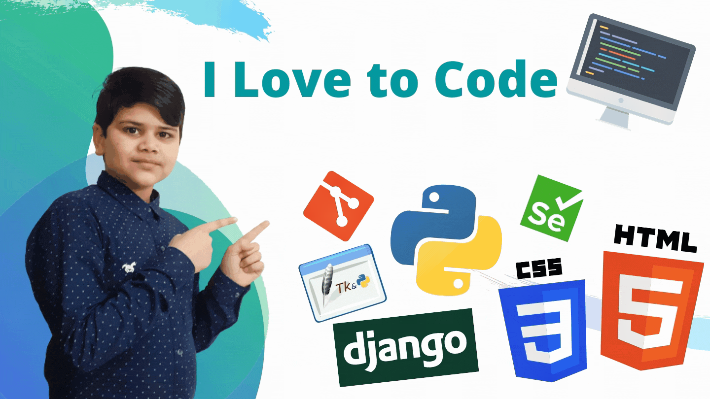

### My Name is Yash Varshney
###### I am a Boy of Class 5
I'm Yash from India, and I am an intermediate python programmer. I currently Working on Python Programming Language. I have an interest in Data Analysis, GUI FrameWorks etc.

#### Skills: Python, Automation, Full-Stack-Web Development, GUI FrameWorks, Django Web FrameWork.

- 🔭 I’m currently working on Python 
- 🌱 I’m currently learning Data Science and Automation With Python 
- 📫 How to reach me: yash.gurukul12@gmail.com, https://www.reddit.com/user/Yash_Varshney 

 
#### My Popular Repos
 
 
 
 
 
 

<h3>Follow Me On - </h3>

